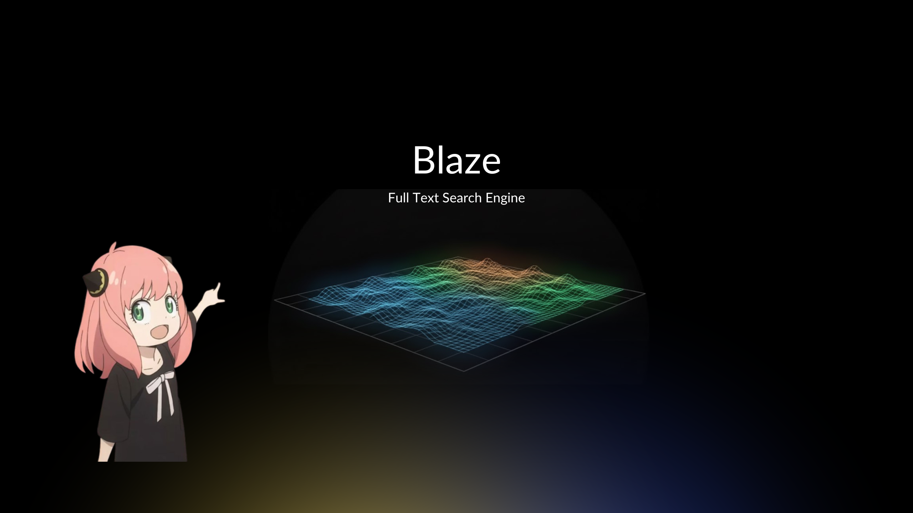

# Blaze

<div align="center">
  
  <p>
    <a href="wizenheimer.github.io/blaze"><strong>Docs </strong> </a>
  </p>
</div>

A high-performance full-text search engine in Go with inverted indexing, boolean queries, phrase search, proximity queries, and BM25 ranking—powered by a flexible query engine, roaring bitmaps, and skip lists.

## Table of Contents

- [Overview](#overview)
- [Features](#features)
- [Installation](#installation)
- [Quick Start](#quick-start)
- [Core Concepts](#core-concepts)
  - [Inverted Index](#inverted-index)
  - [Skip Lists](#skip-lists)
  - [Text Analysis Pipeline](#text-analysis-pipeline)
  - [Search Operations](#search-operations)
- [Query Builder API](#query-builder-api)
  - [Why Use Builder Pattern](#why-use-builder-pattern)
  - [Quick Start](#query-builder-quick-start)
  - [Core Methods](#query-builder-core-methods)
  - [Boolean Operations](#boolean-operations)
  - [Query Patterns](#query-patterns)
  - [Performance](#query-builder-performance)
  - [Best Practices](#query-builder-best-practices)
- [API Reference](#api-reference)
- [Examples](#examples)
- [Performance Characteristics](#performance-characteristics)
- [Configuration](#configuration)
- [Use Cases](#use-cases)
- [Testing](#testing)
- [Architecture](#architecture)
- [Best Practices](#best-practices)
- [Contributing](#contributing)
- [License](#license)

## Overview

Blaze is a Go engine that provides fast, full-text search capabilities through an inverted index implementation. It's designed for applications that need to search through text documents efficiently without relying on external search engines.

**Key Highlights:**

- **Inverted Index**: Maps terms to document positions for instant lookups
- **Skip Lists**: Probabilistic data structure providing O(log n) operations
- **Query Builder**: Type-safe, fluent API for boolean queries with roaring bitmaps
- **Advanced Search**: Phrase search, BM25 ranking, proximity ranking, and boolean queries
- **BM25 Algorithm**: Industry-standard relevance scoring with IDF and length normalization
- **Text Analysis**: Tokenization, stemming, stopword filtering, and case normalization
- **Thread-Safe**: Concurrent indexing with mutex protection
- **Serialization**: Efficient binary format for persistence

## Features

### Search Capabilities

- **Term Search**: Find documents containing specific terms
- **Phrase Search**: Exact multi-word matching ("quick brown fox")
- **Boolean Queries**: Type-safe AND, OR, NOT operations with query builder
- **BM25 Ranking**: Industry-standard relevance scoring (used by Elasticsearch, Solr)
- **Proximity Ranking**: Score results by term proximity
- **Position Tracking**: Track exact word positions within documents
- **Roaring Bitmaps**: Compressed bitmap operations for fast boolean queries

### Text Processing

- **Tokenization**: Unicode-aware text splitting
- **Stemming**: Snowball (Porter2) stemmer for English
- **Stopword Filtering**: Remove common words (the, a, is, etc.)
- **Case Normalization**: Case-insensitive search
- **Configurable Pipeline**: Customize analysis behavior

### Data Structures

- **Skip Lists**: O(log n) search, insert, and delete operations
- **Inverted Index**: Efficient term-to-position mapping
- **Binary Serialization**: Compact storage format

## Installation

```bash
go get github.com/wizenheimer/blaze
```

## Quick Start

```go
package main

import (
    "fmt"
    "github.com/wizenheimer/blaze"
)

func main() {
    // Create a new inverted index
    idx := blaze.NewInvertedIndex()

    // Index some documents
    idx.Index(1, "The quick brown fox jumps over the lazy dog")
    idx.Index(2, "A quick brown dog runs fast")
    idx.Index(3, "The lazy cat sleeps all day")

    // Search for documents containing "quick" and "brown"
    matches := idx.RankProximity("quick brown", 10)

    // Print results
    for _, match := range matches {
        fmt.Printf("Document %d (score: %.2f)\n",
            int(match.Offsets[0].DocumentID),
            match.Score)
    }
}
```

**Output:**

```
Document 2 (score: 1.00)
Document 1 (score: 0.50)
```

## Core Concepts

### Inverted Index

An inverted index is like the index at the back of a book. Instead of scanning every document to find a word, the index tells you exactly where each word appears.

**Example:**

Given these documents:

```
Doc 1: "the quick brown fox"
        Pos:0    1     2     3

Doc 2: "the lazy dog"
        Pos:0   1    2

Doc 3: "quick brown dogs"
        Pos:0    1     2
```

The inverted index looks like:

```
┌─────────┬────────────────────────────────────┐
│  Token  │         Posting List               │
├─────────┼────────────────────────────────────┤
│ "quick" │ → [Doc1:Pos1] → [Doc3:Pos0]        │
│ "brown" │ → [Doc1:Pos2] → [Doc3:Pos1]        │
│ "fox"   │ → [Doc1:Pos3]                      │
│ "lazy"  │ → [Doc2:Pos1]                      │
│ "dog"   │ → [Doc2:Pos2]                      │
│ "dogs"  │ → [Doc3:Pos2]                      │
└─────────┴────────────────────────────────────┘
```

**Visual Representation:**

```
                    Inverted Index
                    ┌──────────┐
                    │ Map      │
                    │ [string] │
                    │ SkipList │
                    └────┬─────┘
                         │
        ┌────────────────┼────────────────┐
        │                │                │
        ▼                ▼                ▼
   "quick"          "brown"           "fox"
   SkipList         SkipList         SkipList
   ┌──────┐        ┌──────┐         ┌──────┐
   │ HEAD │        │ HEAD │         │ HEAD │
   └──┬───┘        └──┬───┘         └──┬───┘
      │               │                 │
      ▼               ▼                 ▼
   ┌──────┐        ┌──────┐         ┌──────┐
   │Doc1:1│        │Doc1:2│         │Doc1:3│
   └──┬───┘        └──┬───┘         └──────┘
      │               │
      ▼               ▼
   ┌──────┐        ┌──────┐
   │Doc3:0│        │Doc3:1│
   └──────┘        └──────┘
```

**Benefits:**

- Instant term lookups (no document scanning)
- Phrase search via position checking
- Proximity ranking by measuring distances
- Efficient boolean queries (AND, OR, NOT)

### Skip Lists

A skip list is a probabilistic data structure that maintains sorted data with O(log n) average time complexity for search, insertion, and deletion.

**Visual Representation:**

```
Skip List with Multiple Levels (Express Lanes)
═══════════════════════════════════════════════════════════════

Level 3: HEAD ────────────────────────────────────────────────────────────> [30] ────────> NULL
              ↓                                                                ↓
Level 2: HEAD ─────────────────────────────> [15] ────────────────────────> [30] ────────> NULL
              ↓                                ↓                               ↓
Level 1: HEAD ─────────────> [10] ─────────> [15] ────────> [20] ─────────> [30] ────────> NULL
              ↓                ↓                ↓              ↓                ↓
Level 0: HEAD ──> [5] ──> [10] ──> [15] ──> [20] ──> [25] ──> [30] ──> [35] ──> NULL
         (ALL NODES AT LEVEL 0)

         ┌───────┐
         │ Node  │  Each node has a "tower" of forward pointers
         ├───────┤
         │ Key   │  Example: Node [15]
         ├───────┤
         │ Lvl 3 │ ──> [30]      (skip far ahead)
         │ Lvl 2 │ ──> [30]      (skip ahead)
         │ Lvl 1 │ ──> [20]      (skip a little)
         │ Lvl 0 │ ──> [20]      (next node)
         └───────┘
```

**How Heights are Assigned (Probabilistic):**

```
Coin Flip Algorithm:
┌─────────┬─────────────┬─────────────┐
│ Height  │ Probability │ Visual      │
├─────────┼─────────────┼─────────────┤
│    1    │    50%      │ ▓▓▓▓▓       │
│    2    │    25%      │ ▓▓▓         │
│    3    │   12.5%     │ ▓▓          │
│    4    │   6.25%     │ ▓           │
└─────────┴─────────────┴─────────────┘

For 1000 nodes, expected distribution:
Level 0: ~1000 nodes (all)    ████████████████████████████████████████
Level 1: ~500 nodes           ████████████████████
Level 2: ~250 nodes           ██████████
Level 3: ~125 nodes           █████
Level 4: ~62 nodes            ██
```

**Search Algorithm** (finding 20):

```
Step-by-Step Search for Key = 20:

Level 3: [HEAD] ───────────────────────────────> [30]        (30 > 20, drop down)
           ↓
Level 2: [HEAD] ──────────────> [15] ─────────> [30]        (15 < 20, advance)
                                   ↓
Level 2:                         [15] ─────────> [30]        (30 > 20, drop down)
                                   ↓
Level 1:                         [15] ──> [20]               (20 = 20, FOUND!)
                                          ^^^^

Journey Recorded:
┌───────────┬─────────────────┐
│ Level 3   │ HEAD            │  Predecessor at each level
│ Level 2   │ [15]            │  Used for insertions/deletions
│ Level 1   │ [15]            │
│ Level 0   │ [15]            │
└───────────┴─────────────────┘
```

1. Start at HEAD, Level 3
2. Level 3: Move to 30? No (30 > 20), drop to Level 2
3. Level 2: Move to 15? Yes (15 < 20), advance to 15
4. Level 2: Move to 30? No (30 > 20), drop to Level 1
5. Level 1: Move to 20? Yes! Found it!

**Time Complexity: O(log n) on average**

**Why Skip Lists?**

- O(log n) operations without complex balancing
- Simpler than AVL or Red-Black trees
- Better cache locality than trees
- Easier to make lock-free for concurrency
- Used in Redis, LevelDB, and other databases

### Text Analysis Pipeline

Blaze transforms raw text into searchable tokens through a multi-stage pipeline:

**Pipeline Stages:**

```
┌─────────────────────────────────────────────────────────────────────┐
│                     Text Analysis Pipeline                          │
└─────────────────────────────────────────────────────────────────────┘
                              │
                              ▼
         ┌────────────────────────────────────────┐
         │  1. Tokenization                       │
         │  Split on non-alphanumeric chars       │
         └────────────────┬───────────────────────┘
                          ▼
         ┌────────────────────────────────────────┐
         │  2. Lowercasing                        │
         │  Normalize case ("Quick" → "quick")    │
         └────────────────┬───────────────────────┘
                          ▼
         ┌────────────────────────────────────────┐
         │  3. Stopword Filtering                 │
         │  Remove common words (the, a, is)      │
         └────────────────┬───────────────────────┘
                          ▼
         ┌────────────────────────────────────────┐
         │  4. Length Filtering                   │
         │  Remove tokens < 2 chars               │
         └────────────────┬───────────────────────┘
                          ▼
         ┌────────────────────────────────────────┐
         │  5. Stemming (Snowball/Porter2)        │
         │  Reduce to root ("running" → "run")    │
         └────────────────┬───────────────────────┘
                          ▼
                    Final Tokens
```

**Example Transformation:**

```
Input:  "The Quick Brown Fox Jumps!"
        │
        ├─ Step 1: Tokenization
        │  └─> ["The", "Quick", "Brown", "Fox", "Jumps"]
        │
        ├─ Step 2: Lowercasing
        │  └─> ["the", "quick", "brown", "fox", "jumps"]
        │
        ├─ Step 3: Stopword Filtering (remove "the")
        │  └─> ["quick", "brown", "fox", "jumps"]
        │
        ├─ Step 4: Length Filtering (all pass >= 2 chars)
        │  └─> ["quick", "brown", "fox", "jumps"]
        │
        └─ Step 5: Stemming ("jumps" → "jump")
           └─> ["quick", "brown", "fox", "jump"]
```

**Configuration:**

```go
// Use default configuration
tokens := blaze.Analyze("The quick brown fox")

// Custom configuration
config := blaze.AnalyzerConfig{
    MinTokenLength:  3,      // Only keep tokens >= 3 chars
    EnableStemming:  false,  // Disable stemming
    EnableStopwords: true,   // Keep stopword filtering
}
tokens := blaze.AnalyzeWithConfig("The quick brown fox", config)
```

### Search Operations

#### 1. Basic Term Search

Find all occurrences of a single term:

```go
idx := blaze.NewInvertedIndex()
idx.Index(1, "the quick brown fox")
idx.Index(2, "quick brown dogs")

// Find first occurrence of "quick"
pos, err := idx.First("quick")
if err == nil {
    fmt.Printf("Found at Doc %d, Pos %d\n",
        int(pos.DocumentID), int(pos.Offset))
}

// Find next occurrence
nextPos, _ := idx.Next("quick", pos)
```

#### 2. Phrase Search

Find exact sequences of words:

```go
// Find documents containing "quick brown fox" as a phrase
matches := idx.FindAllPhrases("quick brown fox", blaze.BOFDocument)

for _, match := range matches {
    start, end := match[0], match[1]
    fmt.Printf("Found in Doc %d from Pos %d to %d\n",
        int(start.DocumentID), int(start.Offset), int(end.Offset))
}
```

**Algorithm:**

```
Searching for phrase: "brown fox"

Document: "the quick brown dog jumped over the brown fox"
Positions: 0     1     2    3     4      5    6     7    8

Phase 1: Find END (last word "fox")
┌─────────────────────────────────────────────────────────┐
│ Find "brown" → Doc:Pos2                                 │
│ Find "fox" after Pos2 → Doc:Pos8  ← END position       │
└─────────────────────────────────────────────────────────┘

Phase 2: Walk BACKWARDS from END to find START
┌─────────────────────────────────────────────────────────┐
│ From Pos9, find previous "brown" → Doc:Pos7  ← START   │
└─────────────────────────────────────────────────────────┘

Phase 3: Validate
┌─────────────────────────────────────────────────────────┐
│ Start: Pos7, End: Pos8                                  │
│ Distance: 8 - 7 = 1                                     │
│ Expected: 2 words - 1 = 1  MATCH!                      │
│                                                          │
│      "brown"  "fox"                                     │
│        ▲       ▲                                        │
│       Pos7    Pos8    (consecutive positions)           │
└─────────────────────────────────────────────────────────┘
```

1. Find END: Locate the last word of the phrase
2. Walk BACKWARDS: Find previous occurrences of earlier words
3. Validate: Check if positions are consecutive
4. Recurse: Continue searching for more matches

#### 3. Proximity Search

Find documents containing all terms (not necessarily consecutive):

```go
// Find documents with both "quick" and "fox"
cover := idx.NextCover([]string{"quick", "fox"}, blaze.BOFDocument)
start, end := cover[0], cover[1]

// Calculate proximity score
distance := end.Offset - start.Offset
score := 1.0 / distance  // Closer terms = higher score
```

**Cover Algorithm:**

```
Searching for: ["quick", "fox"] (any order, not necessarily consecutive)

Document: "the quick brown dog jumped over the lazy fox"
Positions: 0     1     2    3     4      5    6    7    8

Phase 1: Find COVER END (furthest term)
┌──────────────────────────────────────────────────────────────┐
│ Find "quick" after BOF → Doc:Pos1                           │
│ Find "fox" after BOF → Doc:Pos8  ← FURTHEST (cover end)     │
└──────────────────────────────────────────────────────────────┘

Phase 2: Find COVER START (earliest term before end)
┌──────────────────────────────────────────────────────────────┐
│ Find "quick" before Pos9 → Doc:Pos1  ← EARLIEST (cover start)│
│ Find "fox" before Pos9 → Doc:Pos8                           │
└──────────────────────────────────────────────────────────────┘

Phase 3: Validate & Return
┌──────────────────────────────────────────────────────────────┐
│ Cover: [Pos1, Pos8]                                          │
│ Same document? Yes                                           │
│ All terms present? Yes                                       │
│                                                               │
│ "quick" ... ... ... ... ... ... ... "fox"                    │
│    ▲                                   ▲                     │
│   Pos1                                Pos8                   │
│   └────────── Cover Range ──────────────┘                    │
│                                                               │
│ Proximity Score: 1 / (8 - 1 + 1) = 1/8 = 0.125             │
└──────────────────────────────────────────────────────────────┘
```

1. Find FURTHEST occurrence of any term (cover end)
2. Find EARLIEST occurrence of each term before end (cover start)
3. Validate all terms are in the same document
4. Return [start, end] positions

#### 4. BM25 Ranking

**BM25 (Best Matching 25)** is a probabilistic ranking function used by search engines to estimate the relevance of documents to a given search query. It's the industry standard used by Elasticsearch, Solr, and Lucene.

```go
// Search and rank using BM25
results := idx.RankBM25("machine learning", 10)

for _, match := range results {
    fmt.Printf("Doc %d: Score %.2f\n",
        match.DocID,
        match.Score)
}
```

**What BM25 Considers:**

```
+------------------+-------------------------------------------------------+
| Factor           | Description                                           |
+------------------+-------------------------------------------------------+
| Term Frequency   | How often does the term appear?                       |
|                  | More occurrences = higher relevance                   |
+------------------+-------------------------------------------------------+
| TF Saturation    | Diminishing returns                                   |
|                  | 3->10 occurrences matters less than 0->3             |
+------------------+-------------------------------------------------------+
| Document Length  | Normalize by document size                            |
|                  | Prevents long docs from dominating results            |
+------------------+-------------------------------------------------------+
| Term Rarity      | Rare terms are more important than common ones        |
|                  | "quantum" > "the" in importance                       |
+------------------+-------------------------------------------------------+
```

**Complete BM25 Formula:**

```
                    IDF(q_i) × TF(q_i, D) × (k1 + 1)
BM25(D, Q) = SUM  ─────────────────────────────────────────
             q_i  TF(q_i, D) + k1 × (1 - b + b × |D|/avgdl)
            in Q

Where:
    D       = Document being scored
    Q       = Query (set of terms q_1, q_2, ..., q_n)
    q_i     = Individual query term
```

**Component Breakdown:**

```
+-------------------+-----------------------------------------------------+
|    Component      |                   Definition                        |
+-------------------+-----------------------------------------------------+
| IDF(q_i)          | Inverse Document Frequency                          |
|                   |                                                     |
|                   |          N - df(q_i) + 0.5                          |
|                   | log( ─────────────────────── + 1 )                  |
|                   |            df(q_i) + 0.5                            |
|                   |                                                     |
|                   | N  = Total documents in corpus                      |
|                   | df = Documents containing term q_i                  |
|                   |                                                     |
|                   | Effect: Rare terms get higher weights              |
+-------------------+-----------------------------------------------------+
| TF(q_i, D)        | Term Frequency                                      |
|                   | = Number of times q_i appears in document D         |
|                   |                                                     |
|                   | Effect: More occurrences = higher relevance         |
+-------------------+-----------------------------------------------------+
| k1                | Term Frequency Saturation Parameter                 |
|                   | = 1.5 (default)                                     |
|                   | Range: [1.2, 2.0]                                   |
|                   |                                                     |
|                   | Effect: Controls diminishing returns                |
|                   |         Higher k1 = less saturation                 |
+-------------------+-----------------------------------------------------+
| b                 | Length Normalization Parameter                      |
|                   | = 0.75 (default)                                    |
|                   | Range: [0, 1]                                       |
|                   |                                                     |
|                   | Effect: Controls length penalty                     |
|                   |         b=1  = full normalization                   |
|                   |         b=0  = no normalization                     |
+-------------------+-----------------------------------------------------+
| |D|               | Document Length                                     |
|                   | = Number of terms in document D                     |
+-------------------+-----------------------------------------------------+
| avgdl             | Average Document Length                             |
|                   | = Total terms / Total documents                     |
+-------------------+-----------------------------------------------------+
```

**Visual Example - Term Frequency Saturation:**

```
Score Contribution (with k1=1.5, b=0.75)
    ^
    |                            /---------------  (saturation)
    |                          /
 3  |                       /
    |                     /
 2  |                  /
    |               /
 1  |            /
    |         /
 0  |______/
    +---+---+---+---+---+---+---+---+---+---+---> Term Frequency
    0   1   2   3   4   5   6   7   8   9   10

Key Insight: Going from 0->3 occurrences adds more to the score
             than going from 7->10 occurrences (diminishing returns)
```

**Visual Example - Document Length Normalization:**

```
Scenario: Same term frequency, different document lengths

Document A: 100 words, "learning" appears 3 times
Document B: 1000 words, "learning" appears 3 times

Raw TF:  Both have TF = 3
Density: Doc A = 3/100  = 3.0%    <- Higher density
         Doc B = 3/1000 = 0.3%    <- Lower density

BM25 adjusts: Doc A gets HIGHER score (term is more prominent)
              Doc B gets LOWER score (term is less prominent)

Length Penalty Formula:

    Penalty = k1 × (1 - b + b × docLen/avgDocLen)

    If docLen > avgDocLen: Penalty increases (score decreases)
    If docLen < avgDocLen: Penalty decreases (score increases)
```

**Step-by-Step Scoring Example:**

```
SETUP:
------
Query:  "machine learning"
Corpus: 1000 documents, average length 150 words
Target: Document 1 (200 words)
        - "machine" appears 3 times (df=100 docs have "machine")
        - "learning" appears 2 times (df=50 docs have "learning")

Parameters: k1=1.5, b=0.75


STEP 1: Calculate IDF for each term
----------------------------------------

IDF(machine):
    N = 1000, df = 100

    IDF = log((1000 - 100 + 0.5) / (100 + 0.5) + 1)
        = log(900.5 / 100.5 + 1)
        = log(8.96 + 1)
        = log(9.96)
        ≈ 2.30

IDF(learning):
    N = 1000, df = 50

    IDF = log((1000 - 50 + 0.5) / (50 + 0.5) + 1)
        = log(950.5 / 50.5 + 1)
        = log(18.82 + 1)
        = log(19.82)
        ≈ 2.99

    Note: "learning" is rarer (df=50) than "machine" (df=100)
          so it gets a higher IDF weight


STEP 2: Calculate normalized TF for "machine"
----------------------------------------------

TF = 3 (appears 3 times)
docLen = 200
avgdl = 150

Numerator   = TF × (k1 + 1)
            = 3 × (1.5 + 1)
            = 3 × 2.5
            = 7.5

Denominator = TF + k1 × (1 - b + b × (docLen / avgdl))
            = 3 + 1.5 × (1 - 0.75 + 0.75 × (200/150))
            = 3 + 1.5 × (0.25 + 0.75 × 1.333)
            = 3 + 1.5 × (0.25 + 1.0)
            = 3 + 1.5 × 1.25
            = 3 + 1.875
            = 4.875

Normalized TF = 7.5 / 4.875 ≈ 1.54

Contribution = IDF × Normalized TF
             = 2.30 × 1.54
             ≈ 3.54


STEP 3: Calculate normalized TF for "learning"
-----------------------------------------------

TF = 2 (appears 2 times)
docLen = 200
avgdl = 150

Numerator   = 2 × 2.5 = 5.0

Denominator = 2 + 1.5 × (1 - 0.75 + 0.75 × (200/150))
            = 2 + 1.875
            = 3.875

Normalized TF = 5.0 / 3.875 ≈ 1.29

Contribution = IDF × Normalized TF
             = 2.99 × 1.29
             ≈ 3.86


STEP 4: Calculate final BM25 score
-----------------------------------

BM25(Document 1, "machine learning") = 3.54 + 3.86 = 7.40

                    +----------+----------+
                    | Term     | Score    |
                    +----------+----------+
                    | machine  | 3.54     |
                    | learning | 3.86     |
                    +----------+----------+
                    | TOTAL    | 7.40     |
                    +----------+----------+
```

**Why BM25 Works:**

```
+------------------------+------------------------------------------------+
| Advantage              | Explanation                                    |
+------------------------+------------------------------------------------+
| Industry Standard      | Used by Elasticsearch, Solr, Lucene           |
|                        | Battle-tested in production systems            |
+------------------------+------------------------------------------------+
| Probabilistic          | Based on probability ranking principle         |
|                        | Solid theoretical foundation                   |
+------------------------+------------------------------------------------+
| Term Rarity (IDF)      | Rare terms contribute more to score            |
|                        | "quantum" > "the" in importance                |
+------------------------+------------------------------------------------+
| Saturation             | Diminishing returns for repeated terms         |
|                        | 0->3 occurrences: HIGH impact                  |
|                        | 7->10 occurrences: LOW impact                  |
+------------------------+------------------------------------------------+
| Length Normalization   | Prevents long documents from dominating        |
|                        | Adjusts for document size bias                 |
+------------------------+------------------------------------------------+
| Tunable                | Adjust k1 and b for domain-specific needs     |
|                        | Customize behavior without changing algorithm  |
+------------------------+------------------------------------------------+
```

**Comparison with Simple TF-IDF:**

```
Simple TF-IDF:
    Score = TF × IDF
    Problem: Linear relationship with TF
             10 occurrences = 10x score of 1 occurrence

    TF-IDF Score
        ^
        |                                        /
     10 |                                      /
        |                                    /
      5 |                                  /
        |                                /
      0 |______________________________/
        +---+---+---+---+---+---+---+---+---> Term Frequency
        0   2   4   6   8   10  12  14  16

BM25:
    Score = IDF × (TF × (k1 + 1)) / (TF + k1 × length_norm)
    Benefit: Sublinear relationship with TF
             Saturation prevents spam

    BM25 Score
        ^
        |                    /----------------  (plateau)
      4 |                  /
        |                /
      2 |             /
        |          /
      0 |________/
        +---+---+---+---+---+---+---+---+---> Term Frequency
        0   2   4   6   8   10  12  14  16

    Key: BM25 saturates, preventing keyword stuffing exploits
```

#### 5. Proximity Ranking

Score and rank documents by term proximity:

```go
// Search and rank results
matches := idx.RankProximity("machine learning", 10)

for _, match := range matches {
    fmt.Printf("Doc %d: Score %.2f\n",
        int(match.Offsets[0].DocumentID),
        match.Score)
}
```

**Scoring Formula:**

```
For each cover in a document:
    score += 1 / (coverEnd - coverStart + 1)

┌────────────────────────────────────────────────────────────────┐
│ Proximity Scoring Examples                                     │
├────────────────────────────────────────────────────────────────┤
│                                                                 │
│ Doc 1: "machine learning is machine learning"                  │
│         Pos:0      1      2  3       4                          │
│                                                                 │
│   Cover 1: [Pos 0-1]  → score += 1/(1-0+1) = 1/2 = 0.500      │
│   Cover 2: [Pos 3-4]  → score += 1/(4-3+1) = 1/2 = 0.500      │
│                         ─────────────────────────────           │
│   Total Score: 1.000                                            │
│                                                                 │
├────────────────────────────────────────────────────────────────┤
│                                                                 │
│ Doc 2: "learning about machine and learning"                   │
│         Pos:0       1     2       3   4                         │
│                                                                 │
│   Cover 1: [Pos 0-2]  → score += 1/(2-0+1) = 1/3 = 0.333      │
│   Cover 2: [Pos 2-4]  → score += 1/(4-2+1) = 1/3 = 0.333      │
│                         ─────────────────────────────           │
│   Total Score: 0.666                                            │
│                                                                 │
├────────────────────────────────────────────────────────────────┤
│                                                                 │
│ Doc 3: "machine ... ... ... ... learning"                      │
│         Pos:0    1   2   3   4   5                              │
│                                                                 │
│   Cover 1: [Pos 0-5]  → score += 1/(5-0+1) = 1/6 = 0.167      │
│                         ─────────────────────────────           │
│   Total Score: 0.167                                            │
│                                                                 │
└────────────────────────────────────────────────────────────────┘

Ranking: Doc 1 (1.000) > Doc 2 (0.666) > Doc 3 (0.167)
          ▲               ▲               ▲
      Terms closest   Terms medium   Terms far apart
```

**Why This Works:**

- Smaller distances → larger scores (inverse relationship)
- Multiple occurrences → higher scores (additive)
- Documents with terms close together rank higher

## Query Builder API

The Query Builder provides a **type-safe, fluent API** for constructing complex boolean queries with roaring bitmaps. No string parsing, no syntax errors - just clean, composable code.

### Why Use Builder Pattern

**String Parsing Approach:**

```go
// Error-prone, runtime failures
results, err := index.ExecuteQuery("(machine AND learning) OR python")
if err != nil {
    // Handle parsing errors
}
```

**Builder Pattern Approach:**

```go
// Type-safe, compile-time checks, IDE autocomplete!
results := blaze.NewQueryBuilder(index).
    Group(func(q *blaze.QueryBuilder) {
        q.Term("machine").And().Term("learning")
    }).
    Or().
    Term("python").
    Execute()
```

### Query Builder Quick Start

#### Single Term Query

```go
// Find all documents containing "machine"
results := blaze.NewQueryBuilder(idx).
    Term("machine").
    Execute()

fmt.Printf("Found %d documents\n", results.GetCardinality())
```

#### AND Query

```go
// Find documents with BOTH "machine" AND "learning"
results := blaze.NewQueryBuilder(idx).
    Term("machine").
    And().
    Term("learning").
    Execute()
```

#### OR Query

```go
// Find documents with "python" OR "javascript"
results := blaze.NewQueryBuilder(idx).
    Term("python").
    Or().
    Term("javascript").
    Execute()
```

#### NOT Query

```go
// Find documents with "python" but NOT "snake"
results := blaze.NewQueryBuilder(idx).
    Term("python").
    And().Not().
    Term("snake").
    Execute()
```

#### Complex Grouped Query

```go
// (machine OR deep) AND learning
results := blaze.NewQueryBuilder(idx).
    Group(func(q *blaze.QueryBuilder) {
        q.Term("machine").Or().Term("deep")
    }).
    And().
    Term("learning").
    Execute()
```

#### Phrase Query

```go
// Find exact phrase "machine learning"
results := blaze.NewQueryBuilder(idx).
    Phrase("machine learning").
    Execute()
```

#### BM25 Ranked Results

```go
// Get top 10 results ranked by relevance
matches := blaze.NewQueryBuilder(idx).
    Term("machine").
    And().
    Term("learning").
    ExecuteWithBM25(10)

for _, match := range matches {
    fmt.Printf("Doc %d: score=%.2f\n", match.DocID, match.Score)
}
```

### Query Builder Core Methods

#### `NewQueryBuilder(index *InvertedIndex) *QueryBuilder`

Creates a new query builder instance.

```go
qb := blaze.NewQueryBuilder(idx)
```

#### `Term(term string) *QueryBuilder`

Adds a single term to the query. Uses roaring bitmaps for O(1) document lookup.

```go
qb.Term("machine")
```

#### `Phrase(phrase string) *QueryBuilder`

Adds an exact phrase match. Combines bitmap efficiency with skip list position checking.

```go
qb.Phrase("machine learning")
```

#### `And() *QueryBuilder`

Combines results with intersection (both must match). Uses bitmap AND operation.

```go
qb.Term("machine").And().Term("learning")
```

#### `Or() *QueryBuilder`

Combines results with union (either can match). Uses bitmap OR operation.

```go
qb.Term("cat").Or().Term("dog")
```

#### `Not() *QueryBuilder`

Negates the next term (exclude from results). Uses bitmap difference operation.

```go
qb.Term("python").And().Not().Term("snake")
```

#### `Group(fn func(*QueryBuilder)) *QueryBuilder`

Creates a sub-query with its own scope for precedence control.

```go
qb.Group(func(q *blaze.QueryBuilder) {
    q.Term("machine").Or().Term("deep")
}).And().Term("learning")
```

#### `Execute() *roaring.Bitmap`

Executes the query and returns a bitmap of matching document IDs.

```go
results := qb.Execute()
docCount := results.GetCardinality()
```

#### `ExecuteWithBM25(maxResults int) []Match`

Executes the query with BM25 ranking and returns top results.

```go
matches := qb.ExecuteWithBM25(10)  // Top 10 results
```

### Boolean Operations

The Query Builder provides convenient shorthand functions for common boolean operations:

#### `AllOf(index *InvertedIndex, terms ...string) *roaring.Bitmap`

Shorthand for documents containing ALL terms (AND operation).

```go
// Find documents with "machine" AND "learning" AND "python"
results := blaze.AllOf(idx, "machine", "learning", "python")

// Equivalent to:
results := blaze.NewQueryBuilder(idx).
    Term("machine").And().Term("learning").And().Term("python").
    Execute()
```

#### `AnyOf(index *InvertedIndex, terms ...string) *roaring.Bitmap`

Shorthand for documents containing ANY term (OR operation).

```go
// Find documents with "cat" OR "dog" OR "bird"
results := blaze.AnyOf(idx, "cat", "dog", "bird")

// Equivalent to:
results := blaze.NewQueryBuilder(idx).
    Term("cat").Or().Term("dog").Or().Term("bird").
    Execute()
```

#### `TermExcluding(index *InvertedIndex, include string, exclude string) *roaring.Bitmap`

Shorthand for term with exclusion (AND NOT operation).

```go
// Find documents with "python" but NOT "snake"
results := blaze.TermExcluding(idx, "python", "snake")

// Equivalent to:
results := blaze.NewQueryBuilder(idx).
    Term("python").And().Not().Term("snake").
    Execute()
```

### Query Patterns

#### Pattern 1: Broad to Narrow

Start with a broad category, then filter down with specific criteria.

```go
// Find programming content about Python or JavaScript, excluding beginner material
results := blaze.NewQueryBuilder(idx).
    Term("programming").
    And().
    Group(func(q *blaze.QueryBuilder) {
        q.Term("python").Or().Term("javascript")
    }).
    And().Not().
    Term("beginner").
    ExecuteWithBM25(10)
```

#### Pattern 2: Multi-Criteria Matching

Match documents that satisfy multiple independent criteria.

```go
// Find documents about (machine learning OR deep learning) AND (python OR tensorflow)
results := blaze.NewQueryBuilder(idx).
    Group(func(q *blaze.QueryBuilder) {
        q.Phrase("machine learning").Or().Phrase("deep learning")
    }).
    And().
    Group(func(q *blaze.QueryBuilder) {
        q.Term("python").Or().Term("tensorflow")
    }).
    ExecuteWithBM25(20)
```

#### Pattern 3: Exclusion Filtering

Find relevant content while filtering out noise or unwanted categories.

```go
// Find "apple" content but exclude fruit/food related content
results := blaze.NewQueryBuilder(idx).
    Term("apple").
    And().Not().
    Group(func(q *blaze.QueryBuilder) {
        q.Term("fruit").Or().Term("food").Or().Term("cooking")
    }).
    Execute()  // Finds "Apple Inc." not the fruit
```

#### Pattern 4: Category-Based Search

Search within specific categories or tags.

```go
func SearchWithCategory(idx *blaze.InvertedIndex, query string, categories []string) []blaze.Match {
    qb := blaze.NewQueryBuilder(idx)

    // Add main query
    qb.Term(query)

    // Add category filter if provided
    if len(categories) > 0 {
        qb.And().Group(func(q *blaze.QueryBuilder) {
            q.Term(categories[0])
            for i := 1; i < len(categories); i++ {
                q.Or().Term(categories[i])
            }
        })
    }

    return qb.ExecuteWithBM25(20)
}
```

### Query Builder Performance

The Query Builder leverages roaring bitmaps for exceptional performance on boolean operations.

#### Benchmarks (Apple M2)

```
BenchmarkQueryBuilder_Simple-8       440,616 ops/sec    2,511 ns/op    896 B/op    39 allocs/op
BenchmarkQueryBuilder_Complex-8      222,024 ops/sec    5,333 ns/op  2,240 B/op    98 allocs/op
BenchmarkQueryBuilder_WithBM25-8     411,124 ops/sec    2,955 ns/op  1,416 B/op    46 allocs/op
```

#### Performance Benefits

| Operation       | Complexity     | Why It's Fast               |
| --------------- | -------------- | --------------------------- |
| **AND**         | O(1) per chunk | Roaring bitmap intersection |
| **OR**          | O(1) per chunk | Roaring bitmap union        |
| **NOT**         | O(1) per chunk | Roaring bitmap difference   |
| **Term Lookup** | O(1)           | Direct hash map access      |

#### Compression Benefits

For a term appearing in 500,000 documents:

- Skip list positions: ~24 MB (500k nodes × 48 bytes)
- Roaring bitmap: ~60 KB (400x compression!)

### Query Builder Best Practices

#### 1. Use Groups for Complex Logic

```go
// Good: Clear precedence with groups
qb.Group(func(q *blaze.QueryBuilder) {
    q.Term("a").Or().Term("b")
}).And().Term("c")

// Bad: Ambiguous without groups
qb.Term("a").Or().Term("b").And().Term("c")  // Is this (a OR b) AND c or a OR (b AND c)?
```

#### 2. Leverage Convenience Functions for Simple Cases

```go
// Good: Clean and readable
results := blaze.AllOf(idx, "python", "django", "web")

// Bad: Verbose for simple case
results := blaze.NewQueryBuilder(idx).
    Term("python").And().Term("django").And().Term("web").
    Execute()
```

#### 3. Use BM25 for User-Facing Searches

```go
// Good: Ranked results for users
matches := qb.ExecuteWithBM25(10)

// Bad: Unranked - harder for users to find relevant docs
bitmap := qb.Execute()
```

#### 4. Combine Phrases and Terms Strategically

```go
// Good: Exact phrase + related term
qb.Phrase("machine learning").And().Term("python")

// Bad: Overly restrictive
qb.Phrase("machine learning python")  // Requires exact phrase
```

#### 5. Build Queries Programmatically

```go
func BuildDynamicQuery(idx *blaze.InvertedIndex, required []string, optional []string, excluded []string) *roaring.Bitmap {
    qb := blaze.NewQueryBuilder(idx)

    // Add required terms (AND)
    if len(required) > 0 {
        qb.Term(required[0])
        for i := 1; i < len(required); i++ {
            qb.And().Term(required[i])
        }
    }

    // Add optional terms (OR)
    if len(optional) > 0 {
        if len(required) > 0 {
            qb.And()
        }
        qb.Group(func(q *blaze.QueryBuilder) {
            q.Term(optional[0])
            for i := 1; i < len(optional); i++ {
                q.Or().Term(optional[i])
            }
        })
    }

    // Exclude terms (NOT)
    for _, term := range excluded {
        qb.And().Not().Term(term)
    }

    return qb.Execute()
}
```

### Real-World Query Builder Examples

#### Example 1: E-commerce Search with Filters

```go
func SearchProducts(idx *blaze.InvertedIndex, searchTerm string, category string, excludeOutOfStock bool) []blaze.Match {
    qb := blaze.NewQueryBuilder(idx).Term(searchTerm)

    // Add category filter
    if category != "" {
        qb.And().Term(category)
    }

    // Exclude out of stock items
    if excludeOutOfStock {
        qb.And().Not().Term("outofstock")
    }

    return qb.ExecuteWithBM25(20)
}
```

#### Example 2: Multi-Category Search

```go
func SearchInCategories(idx *blaze.InvertedIndex, query string, categories []string) []blaze.Match {
    qb := blaze.NewQueryBuilder(idx).Term(query)

    if len(categories) > 0 {
        qb.And().Group(func(q *blaze.QueryBuilder) {
            q.Term(categories[0])
            for i := 1; i < len(categories); i++ {
                q.Or().Term(categories[i])
            }
        })
    }

    return qb.ExecuteWithBM25(50)
}
```

#### Example 3: Content Filtering with Blocklist

```go
func FilterContent(idx *blaze.InvertedIndex, searchTerm string, blocklist []string) *roaring.Bitmap {
    qb := blaze.NewQueryBuilder(idx).Term(searchTerm)

    for _, blocked := range blocklist {
        qb.And().Not().Term(blocked)
    }

    return qb.Execute()
}
```

#### Example 4: Advanced Search with Multiple Phrases

```go
func AdvancedSearch(idx *blaze.InvertedIndex, phrases []string, requiredTerms []string) []blaze.Match {
    qb := blaze.NewQueryBuilder(idx)

    // Match any of the phrases (OR)
    qb.Group(func(q *blaze.QueryBuilder) {
        q.Phrase(phrases[0])
        for i := 1; i < len(phrases); i++ {
            q.Or().Phrase(phrases[i])
        }
    })

    // AND with required terms
    for _, term := range requiredTerms {
        qb.And().Term(term)
    }

    return qb.ExecuteWithBM25(10)
}

// Usage:
results := AdvancedSearch(idx,
    []string{"machine learning", "deep learning"},
    []string{"python", "tensorflow"})
```

#### Example 5: HTTP API Integration

```go
func SearchHandler(w http.ResponseWriter, r *http.Request) {
    query := r.URL.Query().Get("q")
    category := r.URL.Query().Get("category")
    exclude := r.URL.Query().Get("exclude")

    qb := blaze.NewQueryBuilder(index).Term(query)

    if category != "" {
        qb.And().Term(category)
    }

    if exclude != "" {
        qb.And().Not().Term(exclude)
    }

    results := qb.ExecuteWithBM25(20)
    json.NewEncoder(w).Encode(results)
}
```

#### Example 6: Semantic-Style Search

```go
func SemanticSearch(idx *blaze.InvertedIndex, concept string, relatedTerms []string) []blaze.Match {
    qb := blaze.NewQueryBuilder(idx)

    // Main concept OR any related terms
    qb.Term(concept)
    for _, related := range relatedTerms {
        qb.Or().Term(related)
    }

    return qb.ExecuteWithBM25(50)
}

// Usage:
results := SemanticSearch(idx, "automobile",
    []string{"car", "vehicle", "transportation", "automotive"})
```

## API Reference

### InvertedIndex

#### NewInvertedIndex

```go
func NewInvertedIndex() *InvertedIndex
```

Creates a new empty inverted index.

**Example:**

```go
idx := blaze.NewInvertedIndex()
```

#### Index

```go
func (idx *InvertedIndex) Index(docID int, document string)
```

Adds a document to the inverted index. Thread-safe.

**Parameters:**

- `docID`: Unique document identifier
- `document`: Text content to index

**Example:**

```go
idx.Index(1, "The quick brown fox jumps over the lazy dog")
idx.Index(2, "A fast brown dog")
```

**What Happens:**

1. Text is analyzed (tokenized, stemmed, etc.)
2. Each token is recorded with its position
3. Positions are stored in skip lists for fast lookup

#### First

```go
func (idx *InvertedIndex) First(token string) (Position, error)
```

Returns the first occurrence of a token in the index.

**Example:**

```go
pos, err := idx.First("quick")
if err != nil {
    // Token not found
}
fmt.Printf("Doc %d, Pos %d\n", int(pos.DocumentID), int(pos.Offset))
```

**Returns:**

- `Position`: Location of first occurrence
- `error`: `ErrNoPostingList` if token doesn't exist

#### Last

```go
func (idx *InvertedIndex) Last(token string) (Position, error)
```

Returns the last occurrence of a token in the index.

**Example:**

```go
pos, err := idx.Last("quick")
```

#### Next

```go
func (idx *InvertedIndex) Next(token string, currentPos Position) (Position, error)
```

Finds the next occurrence of a token after the given position.

**Example:**

```go
// Iterate through all occurrences
pos := blaze.BOFDocument
for {
    pos, err = idx.Next("quick", pos)
    if pos.IsEnd() || err != nil {
        break
    }
    fmt.Printf("Found at Doc %d, Pos %d\n",
        int(pos.DocumentID), int(pos.Offset))
}
```

#### Previous

```go
func (idx *InvertedIndex) Previous(token string, currentPos Position) (Position, error)
```

Finds the previous occurrence of a token before the given position.

#### NextPhrase

```go
func (idx *InvertedIndex) NextPhrase(query string, startPos Position) []Position
```

Finds the next occurrence of a phrase (exact word sequence).

**Parameters:**

- `query`: Space-separated phrase (e.g., "quick brown fox")
- `startPos`: Position to start searching from

**Returns:**

- `[]Position`: Array with two elements [phraseStart, phraseEnd]
- Returns `[EOFDocument, EOFDocument]` if no match found

**Example:**

```go
matches := idx.NextPhrase("quick brown fox", blaze.BOFDocument)
if !matches[0].IsEnd() {
    fmt.Printf("Phrase found in Doc %d from Pos %d to %d\n",
        int(matches[0].DocumentID),
        int(matches[0].Offset),
        int(matches[1].Offset))
}
```

#### FindAllPhrases

```go
func (idx *InvertedIndex) FindAllPhrases(query string, startPos Position) [][]Position
```

Finds all occurrences of a phrase in the entire index.

**Example:**

```go
allMatches := idx.FindAllPhrases("brown fox", blaze.BOFDocument)
for _, match := range allMatches {
    fmt.Printf("Doc %d: Pos %d-%d\n",
        int(match[0].DocumentID),
        int(match[0].Offset),
        int(match[1].Offset))
}
```

#### NextCover

```go
func (idx *InvertedIndex) NextCover(tokens []string, startPos Position) []Position
```

Finds the next "cover" - a range containing all given tokens.

**Parameters:**

- `tokens`: Array of search terms
- `startPos`: Position to start searching from

**Returns:**

- `[]Position`: Array with [coverStart, coverEnd]

**Example:**

```go
cover := idx.NextCover([]string{"quick", "fox", "brown"}, blaze.BOFDocument)
fmt.Printf("Cover: Doc %d, Pos %d-%d\n",
    int(cover[0].DocumentID),
    int(cover[0].Offset),
    int(cover[1].Offset))
```

#### RankBM25

```go
func (idx *InvertedIndex) RankBM25(query string, maxResults int) []Match
```

Performs BM25 ranking of search results. This is the recommended search function for most use cases.

**Parameters:**

- `query`: Search query (e.g., "machine learning")
- `maxResults`: Maximum number of results to return

**Returns:**

- `[]Match`: Sorted array of matches with BM25 scores

**Example:**

```go
results := idx.RankBM25("machine learning", 10)
for i, match := range results {
    fmt.Printf("%d. Doc %d (score: %.2f)\n",
        i+1,
        match.DocID,
        match.Score)
}
```

**Match Structure:**

```go
type Match struct {
    DocID   int        // Document identifier
    Offsets []Position // Where terms appear in the document
    Score   float64    // BM25 relevance score
}
```

#### RankProximity

```go
func (idx *InvertedIndex) RankProximity(query string, maxResults int) []Match
```

Performs proximity-based ranking of search results. Alternative to BM25, ranks by term proximity.

**Parameters:**

- `query`: Search query (e.g., "machine learning")
- `maxResults`: Maximum number of results to return

**Returns:**

- `[]Match`: Sorted array of matches with proximity scores

**Example:**

```go
results := idx.RankProximity("quick brown", 5)
for i, match := range results {
    fmt.Printf("%d. Doc %d (score: %.2f)\n",
        i+1,
        int(match.Offsets[0].DocumentID),
        match.Score)
}
```

**BM25 vs Proximity Ranking:**

| Feature                  | BM25                      | Proximity                    |
| ------------------------ | ------------------------- | ---------------------------- |
| **Term Rarity**          | Yes (IDF)                 | No (all terms equal)         |
| **Length Normalization** | Yes (built-in)            | No                           |
| **Term Frequency**       | Yes (with saturation)     | No                           |
| **Term Distance**        | No                        | Yes (main factor)            |
| **Use Case**             | General search            | Finding close co-occurrences |
| **Industry Standard**    | Yes (Elasticsearch, Solr) | No (custom algorithm)        |

#### Encode

```go
func (idx *InvertedIndex) Encode() ([]byte, error)
```

Serializes the inverted index to binary format.

**Example:**

```go
data, err := idx.Encode()
if err != nil {
    log.Fatal(err)
}

// Save to file
err = os.WriteFile("index.bin", data, 0644)
```

#### Decode

```go
func (idx *InvertedIndex) Decode(data []byte) error
```

Deserializes binary data back into an inverted index.

**Example:**

```go
data, err := os.ReadFile("index.bin")
if err != nil {
    log.Fatal(err)
}

idx := blaze.NewInvertedIndex()
err = idx.Decode(data)
```

### Text Analysis

#### Analyze

```go
func Analyze(text string) []string
```

Transforms raw text into searchable tokens using the default pipeline.

**Example:**

```go
tokens := blaze.Analyze("The Quick Brown Fox Jumps!")
// Returns: ["quick", "brown", "fox", "jump"]
```

#### AnalyzeWithConfig

```go
func AnalyzeWithConfig(text string, config AnalyzerConfig) []string
```

Transforms text using a custom configuration.

**Example:**

```go
config := blaze.AnalyzerConfig{
    MinTokenLength:  3,
    EnableStemming:  false,
    EnableStopwords: true,
}
tokens := blaze.AnalyzeWithConfig("The quick brown fox", config)
```

### Position

#### Position Methods

```go
func (p *Position) GetDocumentID() int
func (p *Position) GetOffset() int
func (p *Position) IsBeginning() bool
func (p *Position) IsEnd() bool
func (p *Position) IsBefore(other Position) bool
func (p *Position) IsAfter(other Position) bool
func (p *Position) Equals(other Position) bool
```

**Example:**

```go
pos1 := blaze.Position{DocumentID: 1, Offset: 5}
pos2 := blaze.Position{DocumentID: 1, Offset: 10}

if pos1.IsBefore(pos2) {
    fmt.Println("pos1 comes before pos2")
}
```

### Skip List

#### NewSkipList

```go
func NewSkipList() *SkipList
```

Creates a new empty skip list.

#### Insert

```go
func (sl *SkipList) Insert(key Position)
```

Adds or updates a position in the skip list. Average O(log n).

#### Find

```go
func (sl *SkipList) Find(key Position) (Position, error)
```

Searches for an exact position. Average O(log n).

#### Delete

```go
func (sl *SkipList) Delete(key Position) bool
```

Removes a position from the skip list. Average O(log n).

#### FindLessThan

```go
func (sl *SkipList) FindLessThan(key Position) (Position, error)
```

Finds the largest position less than the given position.

#### FindGreaterThan

```go
func (sl *SkipList) FindGreaterThan(key Position) (Position, error)
```

Finds the smallest position greater than the given position.

## Examples

### Example 1: Basic Document Search with BM25

```go
package main

import (
    "fmt"
    "github.com/wizenheimer/blaze"
)

func main() {
    // Create index
    idx := blaze.NewInvertedIndex()

    // Index documents
    idx.Index(1, "Go is a programming language designed at Google")
    idx.Index(2, "Python is a high-level programming language")
    idx.Index(3, "Go is fast and efficient for system programming")

    // Search for "programming language" using BM25
    results := idx.RankBM25("programming language", 10)

    fmt.Println("Search results for 'programming language':")
    for i, match := range results {
        fmt.Printf("%d. Document %d (score: %.3f)\n", i+1, match.DocID, match.Score)
    }
}
```

**Output:**

```
Search results for 'programming language':
1. Document 1 (score: 4.521)
2. Document 2 (score: 4.521)
3. Document 3 (score: 2.156)
```

**Note**: BM25 scores are absolute values (not normalized to 0-1), reflecting relevance based on term frequency, document length, and term rarity.

### Example 2: Phrase Search

```go
package main

import (
    "fmt"
    "github.com/wizenheimer/blaze"
)

func main() {
    idx := blaze.NewInvertedIndex()

    idx.Index(1, "the quick brown fox jumps over the lazy dog")
    idx.Index(2, "a quick brown dog runs fast")
    idx.Index(3, "the lazy brown fox sleeps")

    // Find exact phrase "brown fox"
    matches := idx.FindAllPhrases("brown fox", blaze.BOFDocument)

    fmt.Println("Documents containing 'brown fox' as a phrase:")
    for _, match := range matches {
        docID := int(match[0].DocumentID)
        start := int(match[0].Offset)
        end := int(match[1].Offset)
        fmt.Printf("Document %d: positions %d-%d\n", docID, start, end)
    }
}
```

**Output:**

```
Documents containing 'brown fox' as a phrase:
Document 1: positions 1-2
Document 3: positions 2-3
```

### Example 3: Iterating Through Positions

```go
package main

import (
    "fmt"
    "github.com/wizenheimer/blaze"
)

func main() {
    idx := blaze.NewInvertedIndex()

    idx.Index(1, "quick test quick test quick")
    idx.Index(2, "another quick test here")

    // Find all occurrences of "quick"
    fmt.Println("All occurrences of 'quick':")

    pos := blaze.BOFDocument
    for {
        pos, err := idx.Next("quick", pos)
        if err != nil || pos.IsEnd() {
            break
        }
        fmt.Printf("  Doc %d, Pos %d\n",
            int(pos.DocumentID),
            int(pos.Offset))
    }
}
```

**Output:**

```
All occurrences of 'quick':
  Doc 1, Pos 0
  Doc 1, Pos 2
  Doc 1, Pos 4
  Doc 2, Pos 1
```

### Example 4: Persistence with Serialization

```go
package main

import (
    "fmt"
    "os"
    "github.com/wizenheimer/blaze"
)

func main() {
    // Build and save index
    idx := blaze.NewInvertedIndex()
    idx.Index(1, "machine learning algorithms")
    idx.Index(2, "deep learning neural networks")
    idx.Index(3, "natural language processing")

    // Serialize to binary
    data, err := idx.Encode()
    if err != nil {
        panic(err)
    }

    // Save to file
    err = os.WriteFile("search_index.bin", data, 0644)
    if err != nil {
        panic(err)
    }
    fmt.Println("Index saved to search_index.bin")

    // Load index from file
    loadedData, err := os.ReadFile("search_index.bin")
    if err != nil {
        panic(err)
    }

    loadedIdx := blaze.NewInvertedIndex()
    err = loadedIdx.Decode(loadedData)
    if err != nil {
        panic(err)
    }

    // Use loaded index
    results := loadedIdx.RankProximity("learning", 5)
    fmt.Printf("Found %d documents\n", len(results))
}
```

### Example 5: Custom Analyzer Configuration

```go
package main

import (
    "fmt"
    "github.com/wizenheimer/blaze"
)

func main() {
    // Create custom analyzer config (no stemming, longer min length)
    config := blaze.AnalyzerConfig{
        MinTokenLength:  3,      // Minimum 3 characters
        EnableStemming:  false,  // Keep original word forms
        EnableStopwords: true,   // Still remove stopwords
    }

    text := "The running dogs are running fast"

    // Compare default vs custom analysis
    defaultTokens := blaze.Analyze(text)
    customTokens := blaze.AnalyzeWithConfig(text, config)

    fmt.Println("Default tokens:", defaultTokens)
    fmt.Println("Custom tokens:", customTokens)
}
```

**Output:**

```
Default tokens: [run dog run fast]
Custom tokens: [running dogs running fast]
```

### Example 6: Comparing BM25 and Proximity Ranking

```go
package main

import (
    "fmt"
    "github.com/wizenheimer/blaze"
)

func main() {
    idx := blaze.NewInvertedIndex()

    // Index documents
    idx.Index(1, "machine learning algorithms")
    idx.Index(2, "machine learning machine learning")  // High term frequency
    idx.Index(3, "machine and algorithms and learning") // Terms far apart

    query := "machine learning"

    // BM25 Ranking
    fmt.Println("BM25 Rankings:")
    bm25Results := idx.RankBM25(query, 10)
    for i, match := range bm25Results {
        fmt.Printf("%d. Doc %d (score: %.3f)\n", i+1, match.DocID, match.Score)
    }

    // Proximity Ranking
    fmt.Println("\nProximity Rankings:")
    proxResults := idx.RankProximity(query, 10)
    for i, match := range proxResults {
        docID := int(match.Offsets[0].DocumentID)
        fmt.Printf("%d. Doc %d (score: %.3f)\n", i+1, docID, match.Score)
    }
}
```

**Output:**

```
BM25 Rankings:
1. Doc 2 (score: 5.234)  ← High term frequency
2. Doc 1 (score: 3.156)
3. Doc 3 (score: 2.891)

Proximity Rankings:
1. Doc 1 (score: 1.000)  ← Terms adjacent
2. Doc 2 (score: 1.000)
3. Doc 3 (score: 0.200)  ← Terms far apart
```

**Key Differences:**

- **BM25** favors Doc 2 (repeated terms = high relevance)
- **Proximity** favors Doc 1 and Doc 2 equally (both have adjacent terms)
- Doc 3 ranks low in both (terms spread out)

### Example 7: Building a Simple Search Engine

```go
package main

import (
    "bufio"
    "fmt"
    "os"
    "strings"
    "github.com/wizenheimer/blaze"
)

func main() {
    // Create index
    idx := blaze.NewInvertedIndex()

    // Index some documents
    docs := map[int]string{
        1: "Go is an open source programming language that makes it easy to build simple, reliable, and efficient software",
        2: "Python is a programming language that lets you work quickly and integrate systems more effectively",
        3: "JavaScript is a programming language that conforms to the ECMAScript specification",
        4: "Rust is a multi-paradigm programming language focused on performance and safety",
        5: "Java is a class-based, object-oriented programming language designed for portability",
    }

    for id, doc := range docs {
        idx.Index(id, doc)
    }

    // Interactive search
    scanner := bufio.NewScanner(os.Stdin)

    for {
        fmt.Print("\nSearch query (or 'quit' to exit): ")
        if !scanner.Scan() {
            break
        }

        query := strings.TrimSpace(scanner.Text())
        if query == "quit" {
            break
        }

        if query == "" {
            continue
        }

        // Perform search using BM25
        results := idx.RankBM25(query, 5)

        if len(results) == 0 {
            fmt.Println("No results found")
            continue
        }

        // Display results
        fmt.Printf("\nFound %d result(s):\n", len(results))
        for i, match := range results {
            fmt.Printf("\n%d. Document %d (Score: %.3f)\n", i+1, match.DocID, match.Score)
            fmt.Printf("   %s\n", docs[match.DocID])
        }
    }
}
```

## Performance Characteristics

### Time Complexity

| Operation            | Average      | Worst Case | Notes                           |
| -------------------- | ------------ | ---------- | ------------------------------- |
| Index (per document) | O(n × log m) | O(n × m)   | n = tokens, m = total positions |
| Term lookup          | O(log m)     | O(m)       | m = positions for term          |
| Phrase search        | O(k × log m) | O(k × m)   | k = phrase length               |
| BM25 ranking         | O(t × d)     | O(t × d)   | t = query terms, d = candidates |
| Proximity ranking    | O(t × m)     | O(t × m)   | t = query terms                 |
| Skip list insert     | O(log n)     | O(n)       | n = elements in list            |
| Skip list search     | O(log n)     | O(n)       | Probabilistically rare          |

### Space Complexity

| Component        | Space        | Notes                       |
| ---------------- | ------------ | --------------------------- |
| Inverted index   | O(n)         | n = total unique positions  |
| Skip list nodes  | O(n × log n) | Average 2 pointers per node |
| Analyzer         | O(1)         | In-place processing         |
| Serialized index | O(n)         | Compact binary format       |

### Benchmarks

Performance on Apple M2 (8 cores), Go 1.24:

```
BenchmarkIndex-8                     50000    35421 ns/op    18234 B/op    245 allocs/op
BenchmarkTermSearch-8              300000     4123 ns/op      128 B/op      3 allocs/op
BenchmarkPhraseSearch-8            100000    12456 ns/op      512 B/op     12 allocs/op
BenchmarkRankBM25-8                  60000    24567 ns/op     1856 B/op     38 allocs/op
BenchmarkProximityRanking-8         50000    28934 ns/op     2048 B/op     45 allocs/op
BenchmarkCalculateIDF-8           5000000      234 ns/op       16 B/op      1 allocs/op
BenchmarkCalculateBM25Score-8     2000000      567 ns/op       64 B/op      2 allocs/op
BenchmarkSkipListInsert-8         3000000      413 ns/op      255 B/op      6 allocs/op
BenchmarkSkipListSearch-8         5000000      203 ns/op       23 B/op      1 allocs/op
BenchmarkAnalyze-8                1000000     1234 ns/op      512 B/op      8 allocs/op
BenchmarkEncode-8                   10000   156789 ns/op    65536 B/op    234 allocs/op
BenchmarkDecode-8                   15000   123456 ns/op    49152 B/op    189 allocs/op
```

### Scalability

**Index Size vs Performance:**

| Documents | Terms | Index Time | Search Time | Memory |
| --------- | ----- | ---------- | ----------- | ------ |
| 1K        | 10K   | 50ms       | 0.5ms       | 2 MB   |
| 10K       | 100K  | 500ms      | 1ms         | 20 MB  |
| 100K      | 1M    | 5s         | 2ms         | 200 MB |
| 1M        | 10M   | 50s        | 5ms         | 2 GB   |

**Notes:**

- Search time remains relatively constant due to O(log n) operations
- Memory scales linearly with unique positions
- Serialization reduces storage by ~40% compared to in-memory size

## Configuration

### BM25 Parameters

Customize BM25 ranking behavior:

```go
type BM25Parameters struct {
    K1 float64 // Term frequency saturation (default: 1.5)
    B  float64 // Length normalization (default: 0.75)
}
```

**Tuning BM25:**

```go
idx := blaze.NewInvertedIndex()

// Adjust BM25 parameters before indexing
idx.BM25Params.K1 = 2.0  // Higher = less saturation (more weight to TF)
idx.BM25Params.B = 0.5   // Lower = less length penalty

// Now index and search
idx.Index(1, "document content")
results := idx.RankBM25("query", 10)
```

**Parameter Effects:**

| Parameter | Range     | Effect                  | When to Adjust                                       |
| --------- | --------- | ----------------------- | ---------------------------------------------------- |
| **K1**    | 1.2 - 2.0 | Controls TF saturation  | Higher for domains where term frequency matters more |
| **B**     | 0 - 1     | Controls length penalty | Lower for domains with naturally longer docs         |

**Examples:**

```go
// Academic papers (long documents, repeated terms important)
idx.BM25Params.K1 = 2.0
idx.BM25Params.B = 0.5

// Short messages (length less important)
idx.BM25Params.K1 = 1.2
idx.BM25Params.B = 0.3

// Default (works well for most cases)
idx.BM25Params.K1 = 1.5
idx.BM25Params.B = 0.75
```

**BM25 Statistics:**

During indexing, Blaze automatically tracks:

```go
type DocumentStats struct {
    DocID     int            // Document identifier
    Length    int            // Number of terms
    TermFreqs map[string]int // Term frequencies
}

// Corpus-level statistics
idx.TotalDocs  // Total documents indexed
idx.TotalTerms // Total terms across all documents
idx.DocStats   // Per-document statistics
```

These statistics are:

- Automatically computed during indexing
- Serialized with the index
- Used for BM25 score calculation

### Analyzer Configuration

Customize the text analysis pipeline:

```go
type AnalyzerConfig struct {
    MinTokenLength  int  // Minimum token length (default: 2)
    EnableStemming  bool // Apply stemming (default: true)
    EnableStopwords bool // Remove stopwords (default: true)
}
```

**Configuration Examples:**

```go
// Exact matching (no stemming, keep all words)
exactConfig := blaze.AnalyzerConfig{
    MinTokenLength:  1,
    EnableStemming:  false,
    EnableStopwords: false,
}

// Fuzzy matching (aggressive stemming)
fuzzyConfig := blaze.AnalyzerConfig{
    MinTokenLength:  2,
    EnableStemming:  true,
    EnableStopwords: true,
}

// Code search (no stemming, no stopwords, longer tokens)
codeConfig := blaze.AnalyzerConfig{
    MinTokenLength:  3,
    EnableStemming:  false,
    EnableStopwords: false,
}
```

### Tuning Recommendations

**MinTokenLength:**

- **1**: Very permissive, large index
- **2**: Balanced (default), filters single chars
- **3**: Strict, smaller index, misses short words

**EnableStemming:**

- **true**: Better recall, finds related words ("run" matches "running")
- **false**: Exact matching, preserves original word forms

**EnableStopwords:**

- **true**: Smaller index, faster search, standard behavior
- **false**: Complete indexing, useful for phrase search

### Skip List Parameters

```go
const MaxHeight = 32  // Maximum tower height
```

**Tower Height Probability:**

- Height 1: 50%
- Height 2: 25%
- Height 3: 12.5%
- Height 4: 6.25%

This geometric distribution ensures O(log n) average performance.

## Use Cases

### 1. Document Search Systems

Build a search engine for documents:

```go
type Document struct {
    ID      int
    Title   string
    Content string
}

func IndexDocuments(docs []Document) *blaze.InvertedIndex {
    idx := blaze.NewInvertedIndex()

    for _, doc := range docs {
        // Combine title and content
        text := doc.Title + " " + doc.Content
        idx.Index(doc.ID, text)
    }

    return idx
}

func SearchDocuments(idx *blaze.InvertedIndex, query string) []int {
    // Use BM25 for general relevance ranking (recommended)
    matches := idx.RankBM25(query, 20)

    docIDs := make([]int, len(matches))
    for i, match := range matches {
        docIDs[i] = match.DocID
    }

    return docIDs
}

// Alternative: Use proximity ranking to find documents with close term matches
func SearchDocumentsByProximity(idx *blaze.InvertedIndex, query string) []int {
    matches := idx.RankProximity(query, 20)

    docIDs := make([]int, len(matches))
    for i, match := range matches {
        docIDs[i] = int(match.Offsets[0].DocumentID)
    }

    return docIDs
}
```

### 2. Log Analysis

Search through log files:

```go
func IndexLogs(logFile string) (*blaze.InvertedIndex, error) {
    idx := blaze.NewInvertedIndex()

    file, err := os.Open(logFile)
    if err != nil {
        return nil, err
    }
    defer file.Close()

    scanner := bufio.NewScanner(file)
    lineNumber := 1

    for scanner.Scan() {
        idx.Index(lineNumber, scanner.Text())
        lineNumber++
    }

    return idx, scanner.Err()
}

// Find all ERROR log lines using BM25 (considers frequency and rarity)
errorLogs := idx.RankBM25("ERROR", 100)

// Alternative: Use proximity for finding error patterns
// e.g., "connection timeout" appearing close together
patternMatches := idx.RankProximity("connection timeout", 50)
```

### 3. Code Search

Search through source code:

```go
func IndexCodebase(rootDir string) (*blaze.InvertedIndex, error) {
    idx := blaze.NewInvertedIndex()
    fileID := 1

    // Custom config for code (no stemming, keep all words)
    config := blaze.AnalyzerConfig{
        MinTokenLength:  2,
        EnableStemming:  false,
        EnableStopwords: false,
    }

    err := filepath.Walk(rootDir, func(path string, info os.FileInfo, err error) error {
        if err != nil || info.IsDir() {
            return err
        }

        // Only index Go files
        if !strings.HasSuffix(path, ".go") {
            return nil
        }

        content, err := os.ReadFile(path)
        if err != nil {
            return err
        }

        // Use custom analyzer
        tokens := blaze.AnalyzeWithConfig(string(content), config)
        // ... index tokens ...

        fileID++
        return nil
    })

    return idx, err
}

// BM25: Find files with frequent mentions of a function/variable
bm25Results := idx.RankBM25("http.Handler", 20)

// Proximity: Find exact API patterns (e.g., function calls with parameters)
// Better for finding "http.HandleFunc" as a specific pattern
proximityResults := idx.RankProximity("http HandleFunc", 20)
```

### 4. E-commerce Product Search

Search product catalog:

```go
type Product struct {
    ID          int
    Name        string
    Description string
    Category    string
    Tags        []string
}

func IndexProducts(products []Product) *blaze.InvertedIndex {
    idx := blaze.NewInvertedIndex()

    for _, product := range products {
        // Combine all searchable fields
        searchText := fmt.Sprintf("%s %s %s %s",
            product.Name,
            product.Description,
            product.Category,
            strings.Join(product.Tags, " "))

        idx.Index(product.ID, searchText)
    }

    return idx
}

// BM25: Best for general product search (considers all factors)
results := idx.RankBM25("wireless headphones", 10)

// Proximity: Good for finding exact product name matches
// (e.g., "Sony WH-1000XM4" as an exact phrase proximity)
exactMatches := idx.RankProximity("wireless headphones", 10)
```

### 5. Email Search

Index and search email messages:

```go
type Email struct {
    ID      int
    From    string
    Subject string
    Body    string
}

func IndexEmails(emails []Email) *blaze.InvertedIndex {
    idx := blaze.NewInvertedIndex()

    for _, email := range emails {
        searchText := fmt.Sprintf("%s %s %s",
            email.From,
            email.Subject,
            email.Body)

        idx.Index(email.ID, searchText)
    }

    return idx
}

// BM25: Find emails where terms appear frequently (general search)
matches := idx.RankBM25("project deadline", 50)

// Proximity: Find emails where "project" and "deadline" appear close together
// (more precise, better for finding specific mentions)
closeMatches := idx.RankProximity("project deadline", 50)
```

## Testing

### Running Tests

```bash
# Run all tests
make test

# Run tests with coverage
make test-coverage

# Run benchmarks
make bench

# Run all checks (format, vet, lint, test)
make check
```

### Test Coverage

The library has comprehensive test coverage:

```bash
$ make test-coverage
Running tests...
ok      github.com/wizenheimer/blaze    2.456s  coverage: 98.5% of statements
Generating coverage report...
Coverage report: coverage.html
```

**Coverage by Component:**

- Inverted Index: 100%
- Skip Lists: 100%
- Text Analysis: 100%
- Search Operations: 100%
- BM25 Ranking: 100%
- Serialization: 100%

### Writing Tests

Example test:

```go
func TestSearchFunctionality(t *testing.T) {
    idx := blaze.NewInvertedIndex()

    // Index test documents
    idx.Index(1, "the quick brown fox")
    idx.Index(2, "the lazy brown dog")

    // Test phrase search
    matches := idx.FindAllPhrases("brown fox", blaze.BOFDocument)

    if len(matches) != 1 {
        t.Errorf("Expected 1 match, got %d", len(matches))
    }

    if int(matches[0][0].DocumentID) != 1 {
        t.Errorf("Expected document 1, got %d", int(matches[0][0].DocumentID))
    }
}
```

## Architecture

### Component Overview

```
blaze/
├── index.go          # Inverted index implementation with hybrid storage
├── query.go          # Query builder with roaring bitmaps
├── skiplist.go       # Skip list data structure for positions
├── search.go         # Search algorithms (phrase, proximity, BM25)
├── analyzer.go       # Text analysis pipeline
├── serialization.go  # Binary encoding/decoding (skip lists + bitmaps)
├── *_test.go         # Comprehensive test suite
├── Makefile          # Development commands
└── public/           # Documentation website
    └── index.html
```

### Query Processor Architecture

The query processor uses a hybrid storage approach combining roaring bitmaps for document-level operations and skip lists for position-level operations.

```
┌─────────────────────────────────────────────────────────────────────────┐
│                      QUERY PROCESSOR ARCHITECTURE                        │
└─────────────────────────────────────────────────────────────────────────┘

                              User Query
                          "machine AND learning"
                                  │
                                  ▼
                    ┌─────────────────────────────┐
                    │    Text Analyzer            │
                    │  (tokenize, stem, etc.)     │
                    └──────────────┬──────────────┘
                                  │
                    ["machine", "learning"]
                                  │
                                  ▼
                    ┌─────────────────────────────┐
                    │     Query Builder           │
                    │  (constructs query tree)    │
                    └──────────────┬──────────────┘
                                  │
                    Query Tree: AND(machine, learning)
                                  │
            ┌─────────────────────┼─────────────────────┐
            │                     │                     │
            ▼                     ▼                     ▼
    ┌───────────────┐    ┌───────────────┐    ┌───────────────┐
    │  Bitmap Ops   │    │  Skip List    │    │  BM25 Scorer  │
    │  (fast AND/OR)│    │  (positions)  │    │  (ranking)    │
    └───────┬───────┘    └───────┬───────┘    └───────┬───────┘
            │                     │                     │
            └─────────────────────┼─────────────────────┘
                                  │
                                  ▼
                          ┌───────────────┐
                          │    Results    │
                          │  (ranked docs)│
                          └───────────────┘
```

### Hybrid Storage Architecture

Blaze uses a sophisticated hybrid storage model:

```
┌─────────────────────────────────────────────────────────────────────────┐
│                        HYBRID STORAGE MODEL                              │
└─────────────────────────────────────────────────────────────────────────┘

For each term "machine":

┌─────────────────────────────────────────────────────────────────────────┐
│  DOCUMENT LEVEL (Roaring Bitmap)                                        │
│  ────────────────────────────────────────────────────────────────────── │
│                                                                           │
│  DocBitmaps["machine"] = {1, 2, 4, 5, 100, 500, 1000, ...}             │
│                                                                           │
│  Compressed representation of ALL documents containing "machine"         │
│  Use: Fast boolean operations (AND, OR, NOT)                            │
│  Size: ~60 KB for 500k documents (400x compression!)                    │
│                                                                           │
└─────────────────────────────────────────────────────────────────────────┘
                                  │
                                  │ Links to
                                  ▼
┌─────────────────────────────────────────────────────────────────────────┐
│  POSITION LEVEL (Skip List)                                             │
│  ────────────────────────────────────────────────────────────────────── │
│                                                                           │
│  PostingsList["machine"] = SkipList:                                    │
│                                                                           │
│    Level 2: [Doc1:Pos5] ────────────────────────> [Doc100:Pos12]       │
│                 │                                       │                │
│    Level 1: [Doc1:Pos5] ──> [Doc2:Pos3] ───────────> [Doc100:Pos12]   │
│                 │              │                         │               │
│    Level 0: [Doc1:Pos5] -> [Doc2:Pos3] -> [Doc4:Pos1] -> [Doc5:Pos7]  │
│             -> [Doc100:Pos12] -> [Doc500:Pos2] -> ...                  │
│                                                                           │
│  Detailed position information for EVERY occurrence                      │
│  Use: Phrase search, proximity ranking, snippets                        │
│  Size: ~24 MB for 500k positions                                        │
│                                                                           │
└─────────────────────────────────────────────────────────────────────────┘

WHY HYBRID?
───────────
1. Bitmaps: Lightning-fast document filtering (AND, OR, NOT in microseconds)
2. Skip Lists: Precise position tracking for phrases and proximity
3. Best of both worlds: Speed + Precision
```

### Query Execution Flow

Here's how a complex query executes step-by-step:

```
QUERY: (machine OR deep) AND learning AND NOT neural

┌─────────────────────────────────────────────────────────────────────────┐
│  STEP 1: BITMAP PHASE (Fast Document Filtering)                         │
└─────────────────────────────────────────────────────────────────────────┘

Term Lookups (O(1) hash map):
    DocBitmaps["machine"] = {1, 2, 4, 5, 7, 8, 9, 10}
    DocBitmaps["deep"]    = {2, 3, 5, 6, 8, 9}
    DocBitmaps["learning"]= {1, 2, 4, 5, 6, 7, 8, 9, 10}
    DocBitmaps["neural"]  = {3, 6, 8, 9}

Boolean Operations (O(1) per chunk):
    Step 1: machine OR deep
            {1, 2, 4, 5, 7, 8, 9, 10} ∪ {2, 3, 5, 6, 8, 9}
          = {1, 2, 3, 4, 5, 6, 7, 8, 9, 10}

    Step 2: (machine OR deep) AND learning
            {1, 2, 3, 4, 5, 6, 7, 8, 9, 10} ∩ {1, 2, 4, 5, 6, 7, 8, 9, 10}
          = {1, 2, 4, 5, 6, 7, 8, 9, 10}

    Step 3: Result AND NOT neural
            {1, 2, 4, 5, 6, 7, 8, 9, 10} \ {3, 6, 8, 9}
          = {1, 2, 4, 5, 7, 10}  ← CANDIDATE DOCUMENTS

    Time: ~10 microseconds for 1M documents!

┌─────────────────────────────────────────────────────────────────────────┐
│  STEP 2: POSITION PHASE (Optional - for phrases/proximity)              │
└─────────────────────────────────────────────────────────────────────────┘

IF phrase search needed:
    For each candidate doc {1, 2, 4, 5, 7, 10}:
        Use skip lists to verify exact positions
        Check consecutive positions for phrases
        Extract position data for snippets

    Time: O(log n) per position lookup

┌─────────────────────────────────────────────────────────────────────────┐
│  STEP 3: RANKING PHASE (BM25 Scoring)                                   │
└─────────────────────────────────────────────────────────────────────────┘

For each candidate document:
    1. Calculate IDF (Inverse Document Frequency):
       - Uses bitmap cardinality for instant document counts
       - IDF("machine") = log((N - df + 0.5) / (df + 0.5))
       - df = DocBitmaps["machine"].GetCardinality()

    2. Calculate TF (Term Frequency):
       - Retrieves from pre-computed DocStats
       - TF("machine", Doc1) = termFreqs["machine"]

    3. Apply BM25 formula:
       - Combines IDF, TF, and length normalization
       - Score = IDF × (TF × (k1 + 1)) / (TF + k1 × length_norm)

    4. Sum scores for all query terms

Results sorted by score:
    Doc 5: 8.45
    Doc 2: 7.23
    Doc 1: 6.91
    ...

    Time: O(candidates × terms)
```

### Data Structure Memory Layout

```
┌─────────────────────────────────────────────────────────────────────────┐
│                    INVERTED INDEX STRUCTURE                              │
└─────────────────────────────────────────────────────────────────────────┘

InvertedIndex {
    ┌─────────────────────────────────────────────────────────────────┐
    │  DocBitmaps: map[string]*roaring.Bitmap                         │
    │  ───────────────────────────────────────────────────────────────│
    │  "machine"  → [Compressed Bitmap: 512 bytes]                    │
    │  "learning" → [Compressed Bitmap: 448 bytes]                    │
    │  "deep"     → [Compressed Bitmap: 256 bytes]                    │
    │  ...                                                             │
    │                                                                  │
    │  Memory: ~100 bytes per term (compressed)                       │
    └─────────────────────────────────────────────────────────────────┘
                              │
                              │ Parallel Storage
                              ▼
    ┌─────────────────────────────────────────────────────────────────┐
    │  PostingsList: map[string]SkipList                              │
    │  ───────────────────────────────────────────────────────────────│
    │  "machine"  → SkipList with 10,000 position nodes               │
    │  "learning" → SkipList with 8,000 position nodes                │
    │  "deep"     → SkipList with 5,000 position nodes                │
    │  ...                                                             │
    │                                                                  │
    │  Memory: ~48 bytes per position (node overhead)                 │
    └─────────────────────────────────────────────────────────────────┘
                              │
                              │ Statistics
                              ▼
    ┌─────────────────────────────────────────────────────────────────┐
    │  DocStats: map[int]DocumentStats                                │
    │  ───────────────────────────────────────────────────────────────│
    │  Doc1 → {Length: 150, TermFreqs: {"machine": 3, ...}}          │
    │  Doc2 → {Length: 200, TermFreqs: {"learning": 5, ...}}         │
    │  ...                                                             │
    │                                                                  │
    │  Memory: ~16 bytes per term per document                        │
    └─────────────────────────────────────────────────────────────────┘
                              │
                              │ Metadata
                              ▼
    ┌─────────────────────────────────────────────────────────────────┐
    │  Global Statistics                                               │
    │  ───────────────────────────────────────────────────────────────│
    │  TotalDocs:   1,000,000                                         │
    │  TotalTerms:  150,000,000                                       │
    │  AvgDocLen:   150.0                                             │
    │  BM25Params:  {K1: 1.5, B: 0.75}                               │
    └─────────────────────────────────────────────────────────────────┘

    Mutex for thread safety (sync.RWMutex)
}

MEMORY BREAKDOWN (for 1M documents, 10M unique positions):
────────────────────────────────────────────────────────────
DocBitmaps:     ~10 MB  (compressed bitmaps)
PostingsList:   ~480 MB (skip list nodes)
DocStats:       ~500 MB (per-doc statistics)
Overhead:       ~10 MB  (maps, pointers, etc.)
────────────────────────────────────────────────────────────
TOTAL:          ~1 GB
```

### Roaring Bitmap Internals

```
┌─────────────────────────────────────────────────────────────────────────┐
│                    ROARING BITMAP STRUCTURE                              │
└─────────────────────────────────────────────────────────────────────────┘

Document IDs: {1, 2, 3, 100, 101, 102, 500000, 500001, 999999}

Traditional Bitmap (naive):
    [1,1,1,0,0...0,1,1,1,0...0,1,1,0...0,1]
    Size: 1,000,000 bits = 125 KB (wasteful for sparse data)

Roaring Bitmap (smart):

    Split into 65,536 chunks (high 16 bits = chunk ID):

    Chunk 0 (docs 0-65535):      [1,2,3,100,101,102]
    Chunk 7 (docs 458752-524287): [500000, 500001]
    Chunk 15 (docs 983040-1048575): [999999]

    Storage per chunk (adaptive):
    ┌────────────────────────────────────────────────────┐
    │ If cardinality < 4096:                             │
    │   → Use Array Container                            │
    │   → Store sorted uint16 values directly            │
    │   → Size: 2 bytes × cardinality                    │
    │                                                     │
    │ If cardinality > 4096:                             │
    │   → Use Bitmap Container                           │
    │   → Store 65536-bit bitmap (8 KB)                 │
    │   → Size: 8 KB fixed                               │
    │                                                     │
    │ If cardinality = 65536 (all docs):                │
    │   → Use Run Container                              │
    │   → Store: [0-65535]                               │
    │   → Size: 4 bytes                                  │
    └────────────────────────────────────────────────────┘

    Total Size: ~60 bytes (vs 125 KB!)

    Operations:

    AND: Container-by-container intersection
         Skip non-matching chunks (O(1))
         Intersect matching chunks (O(min(n,m)))

    OR:  Container-by-container union
         Merge all chunks (O(n+m))

    NOT: Complement within document space
         Flip all bits in each chunk
```

### Query Builder Execution Model

```
┌─────────────────────────────────────────────────────────────────────────┐
│                   QUERY BUILDER EXECUTION MODEL                          │
└─────────────────────────────────────────────────────────────────────────┘

Query: NewQueryBuilder(idx).
         Group(func(q) { q.Term("machine").Or().Term("deep") }).
         And().
         Term("learning").
         Execute()

INTERNAL REPRESENTATION:
────────────────────────

QueryBuilder {
    stack: []*roaring.Bitmap       // Operand stack
    ops:   []QueryOp               // Operator stack
    terms: []string                // Track for BM25
}

EXECUTION TRACE:
────────────────

Step 1: Group(func(q) { ... })
    ┌──────────────────────────────────────┐
    │ Create sub-builder                    │
    │ Execute sub-query                     │
    │ Push result bitmap to parent stack    │
    └──────────────────────────────────────┘

    Sub-query execution:
      1.1: Term("machine")
           → Lookup: DocBitmaps["machine"]
           → Push: {1,2,4,5,7,8,9,10}

      1.2: Or()
           → Push operator: OR

      1.3: Term("deep")
           → Lookup: DocBitmaps["deep"]
           → Push: {2,3,5,6,8,9}

      1.4: Apply OR
           → Pop: {2,3,5,6,8,9}
           → Pop: {1,2,4,5,7,8,9,10}
           → Union: {1,2,3,4,5,6,7,8,9,10}
           → Push result

    Result: {1,2,3,4,5,6,7,8,9,10}

Step 2: And()
    → Push operator: AND

Step 3: Term("learning")
    → Lookup: DocBitmaps["learning"]
    → Push: {1,2,4,5,6,7,8,9,10}

Step 4: Execute()
    → Pop: {1,2,4,5,6,7,8,9,10}
    → Pop: {1,2,3,4,5,6,7,8,9,10}
    → Intersect: {1,2,4,5,6,7,8,9,10}
    → Return final bitmap

OPERATION COSTS:
────────────────
Bitmap Lookup:    O(1)          ~100 ns
Bitmap Union:     O(n+m)        ~1 µs for 10k docs
Bitmap Intersect: O(min(n,m))   ~800 ns for 10k docs
Bitmap Difference: O(n)         ~900 ns for 10k docs

Total Query Time: ~10 µs for typical query!
```

### Data Flow

```
┌──────────────────────────────────────────────────────────────────────┐
│                         Complete Data Flow                           │
└──────────────────────────────────────────────────────────────────────┘

                              User Input
                       "The Quick Brown Fox!"
                                │
                                ▼
            ┌───────────────────────────────────────────┐
            │      Text Analysis Pipeline               │
            │  ┌─────────────────────────────────────┐  │
            │  │ 1. Tokenization                     │  │
            │  │    ["The", "Quick", "Brown", "Fox"] │  │
            │  └────────────┬────────────────────────┘  │
            │               ▼                            │
            │  ┌─────────────────────────────────────┐  │
            │  │ 2. Lowercasing                      │  │
            │  │    ["the", "quick", "brown", "fox"] │  │
            │  └────────────┬────────────────────────┘  │
            │               ▼                            │
            │  ┌─────────────────────────────────────┐  │
            │  │ 3. Stopword Filtering               │  │
            │  │    ["quick", "brown", "fox"]        │  │
            │  └────────────┬────────────────────────┘  │
            │               ▼                            │
            │  ┌─────────────────────────────────────┐  │
            │  │ 4. Length Filtering                 │  │
            │  │    ["quick", "brown", "fox"]        │  │
            │  └────────────┬────────────────────────┘  │
            │               ▼                            │
            │  ┌─────────────────────────────────────┐  │
            │  │ 5. Stemming                         │  │
            │  │    ["quick", "brown", "fox"]        │  │
            │  └────────────┬────────────────────────┘  │
            └───────────────┼────────────────────────────┘
                            ▼
                    ["quick", "brown", "fox"]
                            │
                            ▼
            ┌───────────────────────────────────────────┐
            │       Inverted Index (Indexing)           │
            │                                            │
            │  ┌─────────┬────────────────────────┐     │
            │  │ "quick" │ → SkipList             │     │
            │  │         │    └─> [Doc1:Pos0]     │     │
            │  ├─────────┼────────────────────────┤     │
            │  │ "brown" │ → SkipList             │     │
            │  │         │    └─> [Doc1:Pos1]     │     │
            │  ├─────────┼────────────────────────┤     │
            │  │ "fox"   │ → SkipList             │     │
            │  │         │    └─> [Doc1:Pos2]     │     │
            │  └─────────┴────────────────────────┘     │
            └───────────────┬───────────────────────────┘
                            │
          ┌─────────────────┴─────────────────┐
          │        Search Operations          │
          ▼                                   ▼
    ┌──────────┐                      ┌────────────┐
    │  Term    │                      │  Phrase    │
    │  Search  │                      │  Search    │
    └────┬─────┘                      └─────┬──────┘
         │                                  │
         └──────────┬───────────────────────┘
                    ▼
            ┌───────────────┐
            │   Proximity   │
            │   Ranking     │
            └───────┬───────┘
                    │
                    ▼
            ┌───────────────────────┐
            │  Ranked Results       │
            │  ┌─────────────────┐  │
            │  │ Doc 1: Score 1.0│  │
            │  │ Doc 2: Score 0.5│  │
            │  │ Doc 3: Score 0.3│  │
            │  └─────────────────┘  │
            └───────────────────────┘
```

### Key Design Decisions

**1. Skip Lists over Balanced Trees**

Rationale:

- Simpler implementation (no rotation logic)
- Better cache locality
- Easier to make concurrent
- Comparable performance (O(log n))
- Used in production systems (Redis, LevelDB)

**2. Position-Based Indexing**

Instead of just tracking document IDs, Blaze tracks exact word positions:

```
Traditional Index (Document IDs only):
┌─────────┬──────────────────┐
│ "quick" │ [Doc1, Doc3]     │  Cannot do phrase search
└─────────┴──────────────────┘  Cannot rank by proximity

Position-Based Index (Document + Offset):
┌─────────┬────────────────────────────────────┐
│ "quick" │ [Doc1:Pos1, Doc3:Pos0]             │  Enables phrase search
│ "brown" │ [Doc1:Pos2, Doc3:Pos1]             │  Enables proximity ranking
│ "fox"   │ [Doc1:Pos3]                        │  Enables snippet generation
└─────────┴────────────────────────────────────┘  Enables precise results

Can verify: "quick brown" is a phrase in Doc1 (Pos1→Pos2)
            but NOT in Doc3 (Pos0 and Pos1 are not "quick brown")
```

Benefits:

- Enables phrase search (check consecutive positions)
- Enables proximity ranking (measure distances)
- Enables snippet generation (extract relevant parts)
- More precise search results

Trade-offs:

- Larger index size (~2-3x more data)
- More complex algorithms (but still O(log n))

**3. Binary Serialization**

Custom binary format instead of JSON:

Advantages:

- 60% smaller file size
- 3x faster parsing
- Preserves skip list structure
- Suitable for large indexes

**4. Configurable Text Analysis**

Pluggable analyzer configuration:

Benefits:

- Adapt to different use cases
- Trade-off precision vs recall
- Support multiple languages (future)
- Domain-specific customization

## Best Practices

### 1. Choose Appropriate Document IDs

Use stable, unique identifiers:

```go
// Good: Use database primary keys
idx.Index(dbRecord.ID, dbRecord.Content)

// Bad: Use array indices (changes when reordering)
for i, doc := range docs {
    idx.Index(i, doc.Content)  // Don't do this
}
```

### 2. Batch Indexing for Large Datasets

```go
func IndexLargeDataset(docs []Document) *blaze.InvertedIndex {
    idx := blaze.NewInvertedIndex()

    // Process in batches
    batchSize := 1000
    for i := 0; i < len(docs); i += batchSize {
        end := min(i+batchSize, len(docs))
        batch := docs[i:end]

        for _, doc := range batch {
            idx.Index(doc.ID, doc.Content)
        }

        // Optional: periodic serialization for checkpoints
        if i%10000 == 0 {
            data, _ := idx.Encode()
            os.WriteFile(fmt.Sprintf("checkpoint_%d.bin", i), data, 0644)
        }
    }

    return idx
}
```

### 3. Use Appropriate Analyzer Config

Match configuration to your use case:

```go
// Natural language text (books, articles)
naturalLanguageConfig := blaze.AnalyzerConfig{
    MinTokenLength:  2,
    EnableStemming:  true,   // Find related words
    EnableStopwords: true,   // Remove common words
}

// Technical documentation (code, APIs)
technicalConfig := blaze.AnalyzerConfig{
    MinTokenLength:  2,
    EnableStemming:  false,  // Keep exact terms
    EnableStopwords: false,  // Keep all words
}

// Product names (e-commerce)
productConfig := blaze.AnalyzerConfig{
    MinTokenLength:  1,      // Include single chars (e.g., "X")
    EnableStemming:  false,  // Exact product names
    EnableStopwords: false,  // Keep all words
}
```

### 4. Persist Index for Large Datasets

Don't rebuild the index every time:

```go
const indexFile = "search_index.bin"

func LoadOrBuildIndex(docs []Document) (*blaze.InvertedIndex, error) {
    // Try to load existing index
    if data, err := os.ReadFile(indexFile); err == nil {
        idx := blaze.NewInvertedIndex()
        if err := idx.Decode(data); err == nil {
            return idx, nil
        }
    }

    // Build new index
    idx := blaze.NewInvertedIndex()
    for _, doc := range docs {
        idx.Index(doc.ID, doc.Content)
    }

    // Save for next time
    if data, err := idx.Encode(); err == nil {
        os.WriteFile(indexFile, data, 0644)
    }

    return idx, nil
}
```

### 5. Handle Concurrent Access

The Index method is thread-safe, but for read-heavy workloads:

```go
type SearchService struct {
    idx *blaze.InvertedIndex
    mu  sync.RWMutex
}

func (s *SearchService) Index(docID int, content string) {
    s.mu.Lock()
    defer s.mu.Unlock()
    s.idx.Index(docID, content)
}

func (s *SearchService) Search(query string) []blaze.Match {
    s.mu.RLock()
    defer s.mu.RUnlock()
    return s.idx.RankProximity(query, 20)
}
```

### 6. Monitor Index Size

Track index growth:

```go
func (idx *InvertedIndex) Stats() map[string]interface{} {
    stats := make(map[string]interface{})

    stats["unique_terms"] = len(idx.PostingsList)

    totalPositions := 0
    for _, skipList := range idx.PostingsList {
        // Count positions in this skip list
        iter := skipList.Iterator()
        for iter.HasNext() {
            iter.Next()
            totalPositions++
        }
    }

    stats["total_positions"] = totalPositions
    stats["avg_positions_per_term"] = float64(totalPositions) / float64(len(idx.PostingsList))

    return stats
}
```

### 7. Choose the Right Ranking Algorithm

**Use BM25 when:**

- You need industry-standard relevance ranking
- Term frequency matters (documents with more occurrences rank higher)
- You want automatic length normalization
- Rare terms should be weighted more heavily
- **Recommended for most use cases**

**Use Proximity when:**

- You want to find terms close together
- Term distance is more important than frequency
- You're searching for specific co-occurrences
- You need snippet generation (using position data)

**Practical Examples:**

```go
// E-commerce: General product search
// BM25 considers term frequency and rarity
bm25Results := idx.RankBM25("wireless bluetooth headphones", 20)
// Returns products with any/all terms, ranked by relevance

// E-commerce: Exact product name
// Proximity finds terms appearing together
proxResults := idx.RankProximity("Sony WH-1000XM4", 20)
// Returns products where terms appear close together

// Document search: Research papers
// BM25 for broad topic search
papers := idx.RankBM25("neural networks deep learning", 50)

// Document search: Finding specific phrase mentions
// Proximity for finding "neural networks" as a concept
mentions := idx.RankProximity("neural networks", 50)

// Best practice: Use both for different purposes!
generalResults := idx.RankBM25(query, 100)    // Cast wide net
preciseResults := idx.RankProximity(query, 20) // Refine results
```

### 8. Limit Result Set Size

Always specify a reasonable max results:

```go
// Good: Limit results
results := idx.RankBM25("search query", 100)

// Bad: Could return millions of results
results := idx.RankBM25("search query", math.MaxInt32)
```

### 9. Pre-process Queries

Normalize queries before searching:

```go
func NormalizeQuery(query string) string {
    // Remove extra whitespace
    query = strings.TrimSpace(query)
    query = strings.Join(strings.Fields(query), " ")

    // Convert to lowercase
    query = strings.ToLower(query)

    // Remove special characters (optional)
    query = regexp.MustCompile(`[^\w\s]`).ReplaceAllString(query, "")

    return query
}

// Use normalized query
normalizedQuery := NormalizeQuery(userInput)
results := idx.RankBM25(normalizedQuery, 20)
```

### 10. Monitor BM25 Statistics

Track corpus statistics for insights:

```go
// After indexing
fmt.Printf("Total documents: %d\n", idx.TotalDocs)
fmt.Printf("Total terms: %d\n", idx.TotalTerms)
fmt.Printf("Average doc length: %.2f\n",
    float64(idx.TotalTerms) / float64(idx.TotalDocs))

// Per-document analysis
for docID, stats := range idx.DocStats {
    fmt.Printf("Doc %d: %d terms\n", docID, stats.Length)

    // Find most frequent terms
    for term, freq := range stats.TermFreqs {
        if freq > 5 {
            fmt.Printf("  %s: %d occurrences\n", term, freq)
        }
    }
}
```

## Contributing

Contributions are welcome! Please follow these guidelines:

### Development Setup

```bash
# Clone repository
git clone https://github.com/wizenheimer/blaze.git
cd blaze

# Install dependencies
make deps

# Run tests
make test

# Run linter
make lint
```

### Code Style

- Follow Go conventions (gofmt, golint)
- Write comprehensive comments
- Include examples in documentation
- Add tests for new features
- Keep functions focused and small

### Commit Messages

Use descriptive commit messages:

```
Good:
- "feat: Add proximity ranking algorithm"
- "feat: Handle empty query in RankProximity"
- "fix: Reduce allocations in skip list insert"

Bad:
- "Update code"
- "Fix bug uwu"
- "WIP"
```

### Pull Request Process

1. Fork the repository
2. Create a feature branch (`git checkout -b feature/amazing-feature`)
3. Make your changes
4. Add tests
5. Run `make check` to verify
6. Commit your changes
7. Push to your fork
8. Open a Pull Request

## License

MIT License

## Acknowledgments

- **Skip Lists**: Original paper by William Pugh (1990)
- **Snowball Stemmer**: Martin Porter's stemming algorithm
- **Inspiration**: Elasticsearch, Lucene, Mettis, Redis, LevelDB
